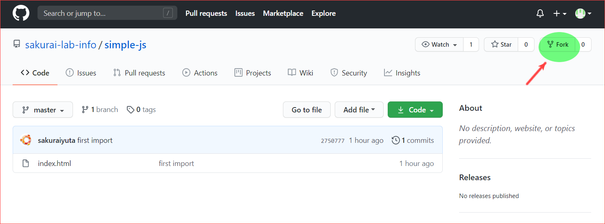
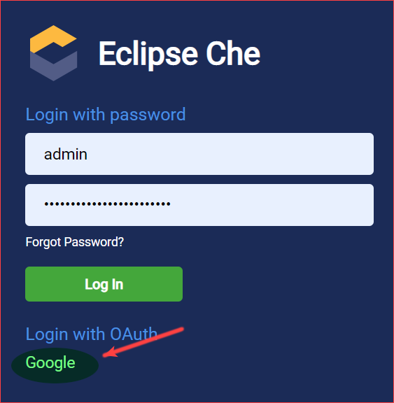
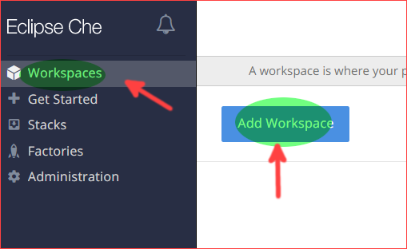
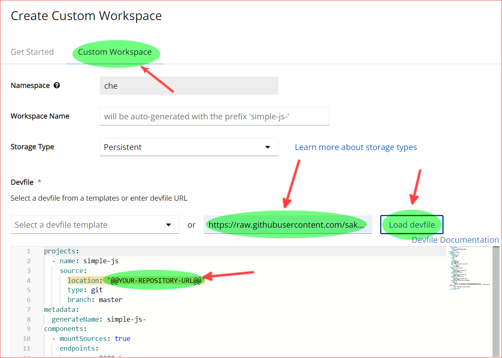
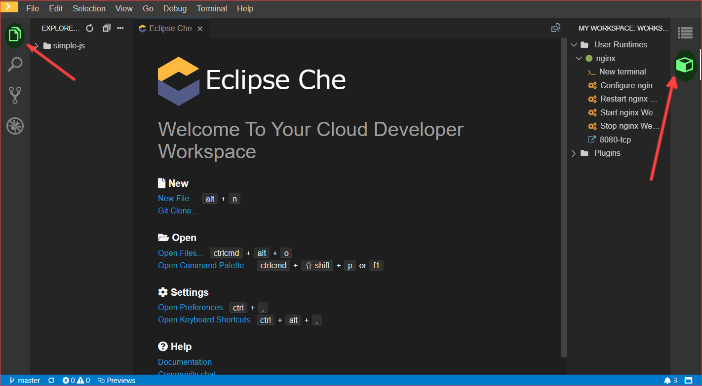
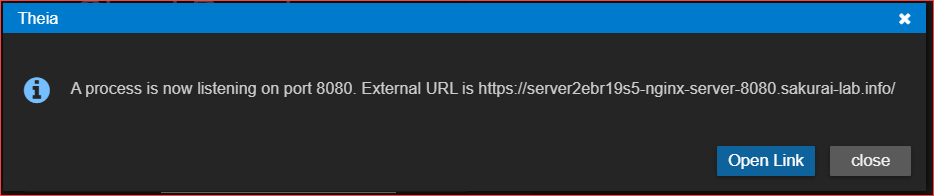
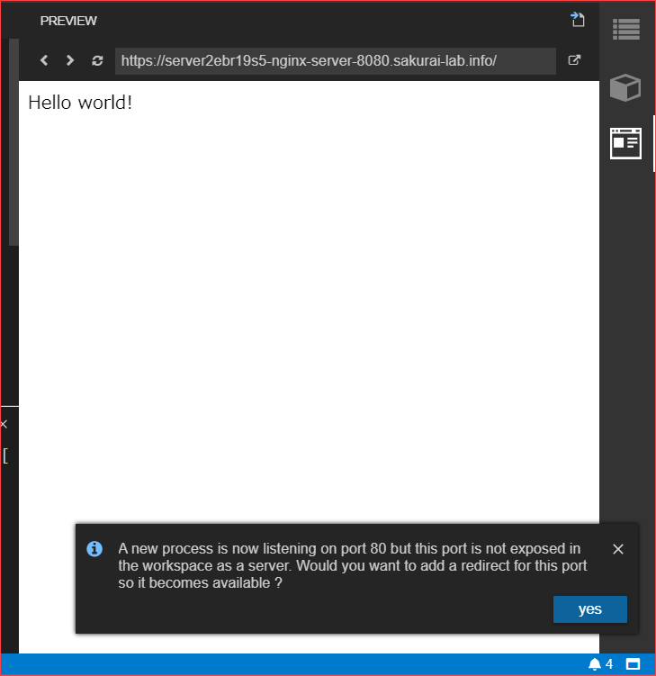

# eclipse-che-devfiles

[Eclipse Che](https://www.eclipse.org/che/)で利用するworkspace設定ファイル群

---

## [simple-js.yaml](./simple-js.yaml)

- Javascript学習用リポジトリ
- 利用コンポーネント
  - [nginx-static](https://github.com/sakurai-lab-info/docker-images/tree/master/nginx-static)
    - [nginx](https://nginx.org/en/)で`/projects/`以下を公開するだけのコンポーネント
- commands:
  - start/stop/restart nginx
  - Configure nginx Web Server DocumentRoot
    - nginxの公開ディレクトリを`simple-js/`にする

### 使い方

まずベースとなるプロジェクトのリポジトリをforkします。

[元リポジトリ](https://github.com/sakurai-lab-info/simple-js)をブラウザで開き、
右上の`Fork`ボタンを押します。

Forkが完了したら、元リポジトリと同じものがcloneされ、自分のアカウントのリポジトリとして追加されます。

そのリポジトリのHTTP URLをコピーしておきます。

次に、[che-che.sakurai-lab.info](https://che-che.sakurai-lab.info)を開きます。
画面下部の`Google`を押し、大学のメールアドレスとパスワードを入力してログインします。

ダッシュボードが表示されるので、左側メニュー`Workspaces`を開き、`Add Workspace`ボタンを押します。

`Custom Workspace`タブを開き、`Devfile`欄の`URL of devfile`項目に当該devfileのURL(下記の通り)を貼ります。

`https://raw.githubusercontent.com/sakurai-lab-info/eclipse-che-devfiles/master/simple-js.yaml`

`Load devfile`ボタンを押すと、下部にDevfileが読み込まれます。
その内容のうち、`@@YOUR-REPOSITORY-URL@@`の部分を自分がforkしたリポジトリのURLに置き換えます。

最後に、左下の`Create & Open`ボタンを押します。

しばらくすると、Workspaceが起動します。

- 左側のアイコンをクリック:
  - 先ほどForkしたリポジトリのファイル一覧が表示されます
- 右側のアイコンをクリック:
  - サーバの実行用コマンド一覧が表示されます

まず最初に、右側の`Configure nginx Web Server DocumentRoot`を押し、サーバ設定を更新します。
次に、`Start nginx Web Server`を押し、Webサーバを起動します。
サーバが起動し、リンクを開くかどうかのダイアログが表示されるので、`Open Link`を押します。

`simple-js/index.html`の内容がWebページとして表示されます。

