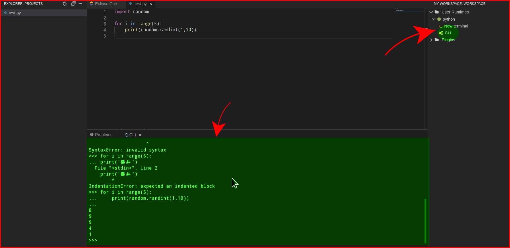

# python-text devfile

このdevfileは、[教科書](https://www.amazon.co.jp/gp/product/487311778X/)の内容をEclipse Cheを使って学習するためのものです。

## 使い方

[che-che.sakurai-lab.info](https://che-che.sakurai-lab.info)を開きます。
画面下部の`Google`を押し、大学のメールアドレスとパスワードを入力してログインします。

ダッシュボードが表示されるので、左側メニュー`Workspaces`を開き、`Add Workspace`ボタンを押します。

`Custom Workspace`タブを開き、`Devfile`欄の`URL of devfile`項目に当該devfileのURL(下記の通り)を貼ります。

`https://raw.githubusercontent.com/sakurai-lab-info/eclipse-che-devfiles/master/python-text/python-text.yaml`

`Load devfile`ボタンを押すと、下部にDevfileが読み込まれます。

最後に、左下の`Create & Open`ボタンを押します。

しばらくすると、Workspaceが起動します。

- 左側のアイコンをクリック:
  - ファイル一覧が表示されます
- 右側のアイコンをクリック:
  - サーバの実行用コマンド一覧が表示されます

## インタラクティブシェルの起動方法

教科書では`IDLE`というものを利用しながらPythonのコードを直接入力・実行結果を表示していますが、
Eclipse CheではTcl/Tk等のGUI環境が使えないため、通常の`python`コマンドで起動するシェルを利用します。

右側のサーバ実行用コマンド一覧から`User Runtimes > python > CLI`を押すことで、インタラクティブシェルが起動します。

画面下部の`>>>`と表示されている部分にPythonのコードを書くと即時実行され、結果が表示されます。
